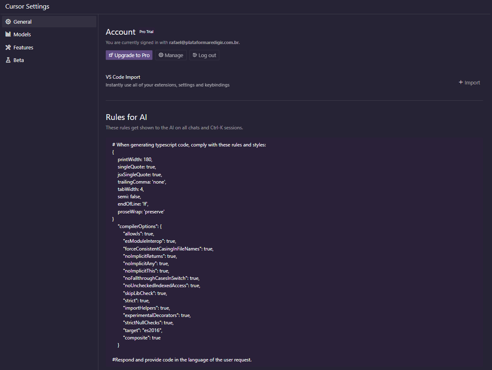
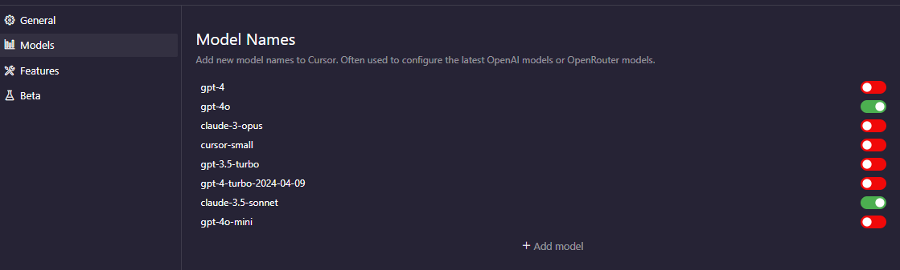
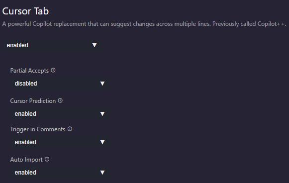
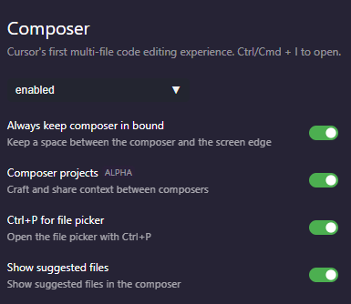
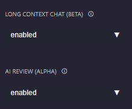

# Cursor Workshop

## Instalação

1. Baixe o Cursor em [https://www.cursor.com/](https://www.cursor.com/)
2. Instale o aplicativo
3. Importe suas extensões e configurações do VS Code
4. (Opcional) Recomendo selecionar "Install cursor" para adicionar o comando `cursor` no terminal, similar ao `code` do VS Code
5. Crie uma conta (use a conta da empresa para facilitar o pagamento) e faça login

## Configurações Recomendadas

### General

- Se não importou ainda as configurações do VS, aqui tem um botão pra isso.

- Em `Rules for AI`, cole seus arquivos de configuração da linguagem (prettier.json, eslint, etc.) e peça para o AI respeitar ao gerar código
  - Adicione outras instruções que julgar necessárias, como forçar a utilização de um idioma específico

### Models

- Mantenha ativados apenas:
  - GPT-4
  - Claude-3.5-sonnet

### Cursor Tab

- [x] Enabled
- [x] Cursor Prediction
- [x] Trigger in Comments
- [x] Auto Import

### Composer

- [x] Enabled
- [x] Composer projects (ALPHA)
- [x] Ctrl+P for file picker
- [x] Show suggested files

### Beta Features

- [x] Long Context Chat (BETA)
- [x] AI Review (ALPHA)

> As demais configurações podem ser mantidas no padrão
